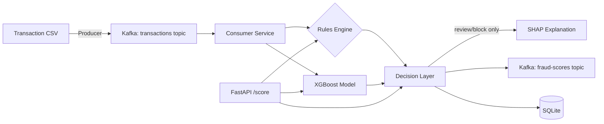

# Architecture

A snapshot of how `fraud-radar-ml` is built, organized by topic rather than by day. For a chronological build log, see the Progress Log in `README.md`.

## System Overview

Two entry points feed the same decision logic: the Kafka pipeline (asynchronous, streaming, for replaying/processing a continuous flow of transactions) and the FastAPI `/score` endpoint (synchronous, for on-demand scoring). Both call the same `score_transaction` function, so a transaction scored via Kafka and the identical transaction scored via the API produce identical decisions — by construction, not by coincidence.

## Components

| Component | File | Responsibility |
|---|---|---|
| Data loading & validation | `src/data_loader.py` | Load and schema-check the raw dataset before anything downstream touches it |
| Feature engineering | `src/features.py` | Stratified train/test split, `hour_of_day` derivation |
| Model training | `src/train.py` | Train/save/load XGBoost and Isolation Forest |
| Evaluation | `src/evaluate.py` | Shared precision/recall/PR-AUC metrics, used identically across all models |
| Rules engine | `src/rules.py` | Explicit, human-readable fraud rules (amount, unusual hour + borderline score) |
| Decision layer | `src/decision.py` | Combines ML probability + fired rules into `allow`/`review`/`block` |
| Explainability | `src/explain.py` | SHAP feature contributions, computed only for flagged decisions |
| Streaming | `src/producer.py`, `src/consumer.py`, `src/kafka_utils.py` | Replay transactions through Kafka, score in real time |
| Persistence | `src/persistence.py` | SQLite storage of every scored transaction |
| API | `src/api.py` | Synchronous `/score` and `/health` endpoints |
| Benchmarking | `src/benchmark.py`, `src/benchmark_kafka.py` | API and consumer throughput/latency measurement |

## Key Design Decisions

### Why XGBoost over Isolation Forest for production scoring
Phase 1 trained and honestly compared three models: Logistic Regression (90.8% recall, 5.6% precision — unusable false-positive rate), XGBoost (83.7% recall, 86.3% precision, PR-AUC 0.881), and Isolation Forest (24.5% recall, PR-AUC 0.103). Isolation Forest's `contamination` parameter was swept from 0.0017 to 0.05 — PR-AUC stayed identical throughout, confirming the weak result was not a tuning artifact but a genuine limitation of the unsupervised approach on this dataset's feature structure. XGBoost is the only model wired into the decision layer and API as a result. Isolation Forest remains a legitimate architectural idea (label-independent anomaly detection catching novel patterns supervised models haven't seen), but this baseline didn't demonstrate that value — noted honestly rather than silently dropped.

### Why a rules engine alongside the ML model, not instead of it
Two rules exist today, both grounded in Phase 1 EDA, not arbitrary:
- **`high_amount`**: EDA found fraud's *median* amount is actually lower than legitimate transactions' — this rule is not a fraud-correlation signal, it's a business guardrail (large transactions warrant scrutiny regardless of historical patterns).
- **`unusual_hour_borderline_score`**: EDA showed fraud clustering during low-traffic (overnight) hours. Rather than flagging all overnight activity (too many false positives, since plenty of legitimate transactions also happen overnight), this rule only fires when an unusual hour combines with an already-borderline ML score — a tiebreaker, not a standalone trigger.

A fired rule can only **escalate** a decision toward more caution (`allow` → `review` → `block`), never downgrade it — verified explicitly in tests, not just assumed.

### Why review/block/allow bands, not a binary threshold
A binary "fraud or not" output doesn't reflect how precision/recall actually trade off in practice (Phase 1 showed this concretely: Logistic Regression's 0.5 threshold produced 1,501 false positives). The band system (`allow` < 0.3, `review` 0.3–0.8, `block` > 0.8) creates a middle ground for genuine uncertainty, where a human or secondary check can intervene rather than the system auto-deciding on borderline cases.

**Honest finding from real validation (Phase 3, Day 4):** running the full Day 2 test set (56,962 transactions, 98 real fraud) through the decision layer showed combined `block`+`review` recall of 84.7% (83/98) and 89.0% precision within `block` specifically — both improvements over the raw 0.5-threshold baseline. But the `review` band's precision is only 1.3% (2 real fraud out of 154 flagged) — it's mostly absorbing normal transactions rather than genuinely ambiguous ones. `ALLOW_THRESHOLD` (currently 0.3) is flagged as a concrete candidate for tightening, not treated as a finished, optimal value.

### Why SHAP only on review/block decisions
SHAP (TreeExplainer) adds real per-prediction latency compared to a raw `predict_proba()` call. Computing it for every transaction — including the ~99.7% that are obviously legitimate — would add meaningful, unnecessary cost. Explanations are only useful where a human might review the decision, so SHAP is scoped to exactly those cases. This mirrors how production fraud systems commonly reserve expensive explainability computation for cases needing review, not a shortcut taken for convenience.

### Why Kafka needed two listeners
Once the producer/consumer were containerized (Phase 2), a real networking problem surfaced: `localhost` means something different from inside a Docker container than from the host machine. The broker now exposes a `HOST` listener (`localhost:9092`, for connections from the Mac directly) and an `INTERNAL` listener (`kafka:29092`, for connections between containers on the Docker network) — a standard, non-obvious Kafka deployment pattern, not a workaround.

### Why SQLite, not Postgres
Zero infrastructure setup (a single file, no server process) was the right scope for proving the persistence pattern works, without adding another moving piece to Phase 2. The SQL used is standard enough that a Postgres migration would be straightforward if this project moved toward genuine production use.

## Performance

### API latency & throughput (`src/benchmark.py`)
In-process benchmark via FastAPI's `TestClient` — measures application processing time, not network/socket overhead. 500 requests, ~10% mixed to trigger `review`/`block` decisions (and therefore SHAP computation), reflecting a realistic blended load rather than only the fast path.

| Metric | Value |
|---|---|
| Throughput | 257.0 req/sec |
| p50 latency | 3.38 ms |
| p95 latency | 5.88 ms |
| p99 latency | 7.16 ms |
| Mean latency | 3.80 ms |
| Max latency | 33.96 ms (single outlier, likely first-request warm-up) |

**Scope limitation, stated honestly:** this is single-threaded and sequential — one request completes before the next starts. It measures real per-request processing cost, not concurrent load behavior (multiple simultaneous requests, uvicorn worker/connection handling). Concurrent-load benchmarking is a legitimate next step, not yet built.

### Kafka consumer throughput (`src/benchmark_kafka.py`)
Measures the real consumer (`consumer.py`, unmodified) processing a batch of 1,000 transactions already queued in the `transactions` topic — includes scoring, SQLite persistence, and re-publishing to `fraud-scores` for every message.

| Metric | Value |
|---|---|
| Throughput | 154.1 messages/sec |
| Total time (1,000 messages) | 6.49s |

**Why this is lower than the API's throughput, explained rather than left as an unexplained gap:** the consumer does strictly more work per message — an extra SQLite write and an extra Kafka publish call that the bare `/score` endpoint doesn't perform. This is an honest reflection of where processing cost lives in the streaming path, not a sign of an underperforming implementation.

**Scope limitation:** this measures processing throughput once messages are already queued — it does not measure full producer-to-consumer latency (time from a transaction being sent to being scored), which would be a separate, also-useful metric if pursued further.

## Known Limitations & Future Work

- Kafka has no persistent volume configured — topics and messages don't survive a full container removal (`docker compose down` + recreation).
- The `review` decision band, while functioning as designed, has low precision (1.3%) in real validation — a concrete tuning target, not yet addressed.
- Isolation Forest is trained and evaluated but not wired into the live decision layer or API — XGBoost is the sole production model today.
- No concurrent-load or full end-to-end (producer-to-consumer) latency benchmarking yet — only sequential API latency and consumer processing throughput have been measured.
- SQLite, not a networked database — appropriate for this project's current scope, would need migration for genuine multi-instance production use.