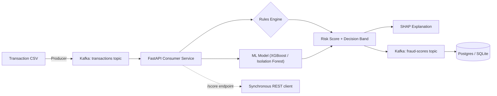

# fraud-radar-ml


A real-time transaction fraud scoring system inspired by **Stripe Radar** — combining a rules engine, machine learning (XGBoost + Isolation Forest), and explainability (SHAP) behind a streaming pipeline, to mirror how production fintech fraud systems are actually architected: not just a model in a notebook, but a scored, explainable, rules-aware decision layer.

## Why this project

Most fraud-detection portfolios stop at "trained a classifier on a Kaggle dataset." This project is built to reflect how fraud scoring actually works in production:

- **Continuous risk score + decision band** (`allow` / `review` / `block`), not a binary label
- **Rules engine alongside the ML model** — mirroring Radar's approach of combining merchant-defined rules with a learned risk score
- **Explainability per decision** — SHAP values surface *why* a transaction was flagged
- **Real-time streaming**, not batch scoring — transactions replayed through Kafka and scored as they arrive
- **Supervised vs. unsupervised comparison** — an honest discussion of why a bank might choose a lower-offline-metric unsupervised model in production (label latency, concept drift)

## Architecture



## Tech Stack

| Layer | Choice |
|---|---|
| Data | [Kaggle Credit Card Fraud Detection (ULB)](https://www.kaggle.com/mlg-ulb/creditcardfraud) |
| Modelling | Scikit-learn (Isolation Forest), XGBoost, SHAP |
| Rules Engine | Custom threshold-based rules (amount, velocity) |
| Streaming | Kafka (Docker Compose, KRaft mode) |
| Serving | FastAPI |
| Containerization | Docker Compose |
| Deployment | AWS |

## Project Structure

```
fraud-radar-ml/
├── README.md
├── requirements.txt
├── .gitignore
├── docker-compose.yml          # added Phase 2
├── data/                       # raw data (gitignored, see setup below)
├── notebooks/
│   └── 01_eda.ipynb
├── src/
│   ├── config.py
│   ├── data_loader.py
│   ├── features.py
│   ├── train.py
│   └── evaluate.py
├── models/                     # trained models (gitignored)
└── tests/
    └── test_features.py
```
## Setup

```bash
git clone https://github.com/RahimAbbas55/Fraud-Radar-ML.git
cd fraud-radar-ml
python -m venv venv
source venv/bin/activate
pip install -r requirements.txt
```

Download the dataset from [Kaggle: Credit Card Fraud Detection (ULB)](https://www.kaggle.com/mlg-ulb/creditcardfraud) and place it at `data/raw/creditcard.csv`. Options:

```bash
# via Kaggle CLI (requires kaggle.json API token in ~/.kaggle/)
kaggle datasets download -d mlg-ulb/creditcardfraud -p data/raw/ --unzip

# or manually: download the zip from the Kaggle page above,
# unzip, and move creditcard.csv into data/raw/
```

Expected shape after download: 284,807 rows × 31 columns (`Time`, `V1`–`V28`, `Amount`, `Class`).

## Roadmap

- [x] Phase 1, Day 1 — data loading, validation, EDA foundations
- [x] **Phase 1 — Data & Modelling**: EDA, supervised vs. unsupervised model comparison (precision/recall/PR-AUC)
- [x] Phase 2, Day 3 — Kafka broker, topics, producer, consumer, SQLite persistence, containerization, end-to-end verification
- [x] **Phase 2 — Kafka Streaming Setup**: Docker Compose Kafka broker, producer replay script, consumer service
- [x] Phase 3, Day 4 — rules engine, decision layer, SHAP explainability, FastAPI endpoint, threshold validation
- [x] **Phase 3 — Radar-Style Decision Layer + API**: rules engine, risk score + decision bands, SHAP explainability, FastAPI endpoint
- [x] Phase 4, Day 5 — benchmarking, ARCHITECTURE.md, Docker/ECR/EC2 deployment, live verification
- [x] **Phase 4 — Monitoring, Docs, Deployment**: latency/throughput benchmarking, architecture docs, AWS deployment

## Progress Log

### Day 1 — Data loading, validation, and EDA foundations
- Added `src/data_loader.py`: validated data loading with explicit schema checks (missing columns, nulls, unexpected target values) so malformed data fails loudly at load time, not silently downstream
- Fixed a data path bug: `RAW_DATA_PATH` originally pointed to `data/creditcard.csv`, but the dataset was organized at `data/raw/creditcard.csv`. Also fixed a `.gitignore` bug in the process — `data/*.csv` only ignores files directly inside `data/`, not nested folders; changed to `data/**/*.csv`
- Added `src/features.py`: stratified train/test split utility (fraud is ~0.17% of the data, so stratification is required — a random split risks a test set with almost no fraud examples) and an `hour_of_day` feature derived from `Time`, motivated directly by the EDA finding that fraud disproportionately clusters in specific (likely overnight) time windows
- Added `pytest.ini` to fix `src` module discovery from the project root
- Wrote 8 unit tests across `data_loader` and `features` using small synthetic dataframes, so the suite stays fast and doesn't depend on the Kaggle CSV being present
- EDA notebook (`01_eda.ipynb`):
  - Class distribution: confirmed ~0.173% fraud rate (492 / 284,807) — this is why accuracy is the wrong metric for this project, and why PR-AUC/precision/recall will be used for model comparison instead
  - `Amount` by class: fraud has a *higher mean* (£122 vs £88) but *lower median* (£9.25 vs £22.00) than legitimate transactions — suggesting a mix of small-value fraud (possibly card-testing) rather than fraud simply skewing toward large purchases
  - `Time` by class: fraud disproportionately spikes during low-traffic windows, consistent with overnight hours — a real-world pattern (fraud is less likely to be noticed while the cardholder is asleep) that directly motivated the `hour_of_day` feature above
  - Correlation of `V1`-`V28` with `Class`: `V17`, `V14`, `V12`, `V10` showed the strongest linear signal; this is a baseline to compare against XGBoost's feature importances in Phase 1's modelling step — agreement would be reassuring, disagreement wouldn't necessarily mean a bug, since correlation only captures linear relationships

### Day 2 — Baseline model training and comparison
- Scaffolded `02_baseline_models.ipynb`, reusing Day 1's validated loader, `hour_of_day` feature, and stratified split — confirmed train/test split held the 0.173% fraud ratio almost exactly (394/98 fraud cases)
- Added `src/evaluate.py`: shared evaluation utilities (precision, recall, F1, PR-AUC, plain-language confusion matrix breakdown) used identically across all three models, guaranteeing a fair comparison
- **Logistic Regression baseline:** hit a convergence warning from `lbfgs`, traced to unscaled features (`Amount`/`Time` vs PCA components on wildly different scales) — fixed with a `Pipeline` + `StandardScaler` to avoid data leakage. Result: 90.8% recall but only 5.6% precision (1,501 false positives to catch 89/98 fraud cases) — a direct, expected consequence of `class_weight='balanced'`
- **XGBoost:** 83.7% recall, 86.3% precision (13 false positives, 82/98 fraud caught) — a substantially more usable precision/recall balance than Logistic Regression, at a small recall cost. PR-AUC 0.881, the strongest of the three models
- **Isolation Forest** (trained only on non-fraud transactions, no fraud labels seen during training): weakest baseline result — 24.5% recall, 18.9% precision, PR-AUC 0.103
- **Contamination tuning investigation:** swept `contamination` from 0.0017 to 0.05. PR-AUC stayed identical (0.1035) at every value — confirming this parameter only shifts the precision/recall cutoff point, not the model's underlying ability to separate fraud from normal transactions. At `contamination=0.05`, recall reached 84.7% (competitive with XGBoost) but produced 2,934 false positives (vs XGBoost's 13) — not a usable tradeoff. Concluded the weak result isn't a tuning artifact; genuinely improving it would require feature selection or deeper hyperparameter changes, flagged as future work
- Promoted training logic into `src/train.py`, a parameterized CLI script (`python -m src.train --model xgboost|isolation_forest`) — chosen over training all three models or hardcoding one, since the project's architecture (see diagram above) calls for both XGBoost and Isolation Forest as parallel signals, and Logistic Regression had already been ruled out as a production candidate given its false-positive rate
- Added `load_model()` utility for reproducible model loading — verified it correctly restores a fully-configured, usable `XGBClassifier` from disk
- Wrote 6 additional unit tests (`evaluate.py`, `train.py`) using synthetic data and mock models, following the same fast/isolated pattern established on Day 1

**Honest takeaway:** XGBoost is the clear leader on offline metrics and the most realistic production candidate right now. Isolation Forest's architectural value (catching novel fraud patterns without labels) remains a valid reason to keep it in the system design, but this baseline doesn't yet demonstrate that value — it was dominated by XGBoost on every metric tested, tuning included.

## Kafka Setup (Phase 2)

Start the Kafka broker:
```bash
docker compose up -d
docker compose ps  # confirm status shows (healthy)
```

Create the required topics (one-time step — topics don't persist if the container is removed via `docker compose down`, only if stopped via `docker compose stop`):
```bash
docker exec fraud-radar-kafka kafka-topics --create \
  --topic transactions \
  --bootstrap-server localhost:9092 \
  --partitions 1 \
  --replication-factor 1

docker exec fraud-radar-kafka kafka-topics --create \
  --topic fraud-scores \
  --bootstrap-server localhost:9092 \
  --partitions 1 \
  --replication-factor 1
```

### Day 3 — Kafka streaming setup (complete)
- Added `docker-compose.yml`: single-broker Kafka in KRaft mode (no Zookeeper) — a deliberate scope choice for a portfolio-scale demo over a multi-broker cluster
- Created `transactions` and `fraud-scores` topics (1 partition, replication factor 1 each — appropriate for a single-broker setup where ordering matters more than parallel throughput)
- Added `src/kafka_utils.py`: shared broker config and JSON serialization/deserialization, reused by both producer and consumer
- Added `src/producer.py`: replays `creditcard.csv` row-by-row to the `transactions` topic with a configurable delay, simulating near-real-time arrival
- Added `src/consumer.py`: long-running service that scores each incoming transaction with the trained XGBoost model in real time, publishing results to `fraud-scores`
- **Bug found and fixed during end-to-end testing:** producer wasn't applying the `hour_of_day` feature before sending messages, causing every scored transaction to fail — unit tests hadn't caught this since they used hand-built messages that already included the feature. Fixed by wiring `add_time_of_day_feature` into the producer.
- **Second bug found via testing, not production:** a hand-written test with columns in a different order than training exposed that `score_transaction` had no explicit safeguard against feature order. Fixed by explicitly reindexing to `model.get_booster().feature_names` before scoring.
- **End-to-end verification (local):** 5,000 transactions replayed and scored live. Result: 1 fraud case flagged (`txn_id=4920`, 99.99% confidence), correctly matching the true label. Zero false positives across the batch.
- Added `src/persistence.py`: SQLite persistence layer for scored results (`scored_transactions` table, `INSERT OR REPLACE` to handle reruns against the same synthetic transaction IDs), wired into the consumer so every scored transaction — not just fraud — is durably stored for future querying (e.g. a Phase 3 API endpoint).
- **Containerized the full pipeline:** added a `Dockerfile` for the producer/consumer image, extended `docker-compose.yml` to run Kafka, producer, and consumer together via a single `docker compose up --build`. Required solving a real networking problem: Kafka needed two separate listeners (`HOST` for connections from the host machine, `INTERNAL` for connections between containers on the Docker network), since `localhost` means something different from inside a container than from the host — a common, non-obvious Kafka deployment pattern, not a workaround.
- **End-to-end verification (containerized):** ran the full pipeline via `docker compose up --build` — Kafka started and passed its healthcheck, producer and consumer both correctly waited via `depends_on: condition: service_healthy`, topics were auto-created, producer sent 500 transactions and exited cleanly (`exit code 0`), consumer scored them in real time using the internal `kafka:29092` listener, confirming the networking fix works correctly across containers.

**Honest scope note:** Kafka has no persistent volume configured, so topics and messages don't survive a full container removal (`docker compose down` followed by recreation) — acceptable for a portfolio demo, but a real gap if this needed to survive restarts in a genuine production context. Noted as a candidate for Phase 4 if pursued further.

**Next up:** Phase 3 — Radar-style rules engine, risk score + decision bands (`allow`/`review`/`block`), SHAP explainability, and a FastAPI endpoint that can serve predictions synchronously as well as via the streaming pipeline already built.

**Architecture note:** both topics use a single partition and replication factor of 1 — appropriate for a single-broker demo setup where strict message ordering matters more than parallel throughput. `transactions` carries raw replayed transactions from the producer; `fraud-scores` carries the consumer's scored output (risk score + decision).

Verify topics exist:
```bash
docker exec fraud-radar-kafka kafka-topics --list --bootstrap-server localhost:9092
```

### Day 4 — Radar-style decision layer, SHAP explainability, FastAPI endpoint
- Added `src/rules.py`: rules engine with two rules grounded directly in Day 1 EDA findings — `high_amount` (a guardrail, not a strong standalone signal per EDA) and `unusual_hour_borderline_score` (fires only when an overnight hour combines with an already-borderline ML score, avoiding a naive "flag everything at night" false-positive problem)
- Added `src/decision.py`: combines the ML probability and fired rules into a `allow`/`review`/`block` decision band. Key design choice: a fired rule can only escalate a decision toward more caution, never downgrade it — verified explicitly via tests, not just assumed
- Wired the decision layer into `consumer.py`, replacing the old binary 0.5-threshold logic; updated the SQLite schema (`decision`, `fired_rules` columns replacing the old `prediction` column)
- Added `src/explain.py`: SHAP (TreeExplainer) explainability, computed only for `review`/`block` decisions — a deliberate latency tradeoff, since SHAP is meaningfully slower than a raw prediction and unnecessary for the vast majority of obviously-legitimate transactions
- Added `src/api.py`: FastAPI `/score` endpoint for synchronous scoring, reusing `score_transaction` from the consumer so the Kafka pipeline and the API produce identical decisions by construction, not by coincidence. `/health` endpoint added alongside it
- **Bug found via testing, not production:** a `TestClient` opened in isolation inside one test (for a 422 validation check) triggered the app's `lifespan` shutdown on exit, silently clearing the shared `_state` dict and breaking a *different*, still-open test's model access. Traced to the root cause (shared module-level state across `TestClient` instances) and fixed by removing the unnecessary isolation, rather than patching around the symptom
- **Threshold validation (Stage 11):** ran the real Day 2 test set (56,962 transactions, 98 real fraud) through the full decision layer. Results: combined `block`+`review` recall of 84.7% (83/98) — a small genuine improvement over Day 2's raw 83.7% — and 89.0% precision within the `block` band specifically, better than Day 2's raw 86.3%. Honest finding: the `review` band is under-earning its keep, at 1.3% precision (2 real fraud out of 154 flagged) — most of what lands there is normal, not genuinely ambiguous, activity. Flagged `ALLOW_THRESHOLD` (currently 0.3) as a concrete candidate for tightening in future tuning, rather than treated as a solved, final value.

### Day 5 — Benchmarking, architecture docs, AWS deployment
- Added `src/benchmark.py`: API latency/throughput benchmark via FastAPI's TestClient. Result: 257 req/sec, p50 3.38ms, p95 5.88ms, p99 7.16ms (500 requests, ~10% mixed to trigger review/block + SHAP)
- Added `src/benchmark_kafka.py`: Kafka consumer throughput benchmark using the real, unmodified consumer. Result: 154.1 messages/sec sustained (1,000 messages, includes SQLite write + re-publish per message)
- Added `ARCHITECTURE.md`: full system documentation — component breakdown, every major design decision from all 4 phases with the reasoning behind it, and an honest limitations section
- Fixed Docker build for `linux/amd64` (Apple Silicon builds default to arm64, EC2 needs amd64) via `docker buildx` and `$TARGETPLATFORM`
- Set up GitHub Actions to build and push to ECR automatically on push to main
- **Two real, connected bugs found during deployment, not before:**
  - A trailing comment from an earlier commit landed on the same line as the Dockerfile's `CMD` instruction, silently breaking the array syntax — the container pulled fine but failed to start (`[uvicorn,: not found`)
  - `requirements.txt` had been overwritten at some point with a full local-environment dependency dump (pinned versions specific to my Mac, including packages like `jupyterlab` that have nothing to do with the API) instead of the actual project dependencies — this caused a `pip install` failure that Docker's build cache was silently hiding, since the CMD fix never touched `requirements.txt` and so never invalidated the broken cached layer. Only surfaced by forcing a `--no-cache` rebuild. This also explains why GitHub Actions appeared to silently not trigger — it was very likely failing the same way, not skipping
  - Fixed both: cleaned Dockerfile, restored a minimal `requirements.txt` with no pinned versions
- Deployed to a dedicated EC2 instance: IAM instance role for ECR pull (no AWS keys on the server), SSH restricted to a single IP, API port open publicly
- Verified `/health` and `/score` live over the real internet, not just locally — confirmed a `review` decision with a correctly fired rule and a real SHAP explanation returned from the deployed container

**Honest note:** the EC2 instance is stopped between demo sessions to control cost. [Set up with a static Elastic IP, so the link stays valid whenever it's running. / No Elastic IP configured — the public IP changes on restart, so the live link may not always be reachable.]

**Project status: Phase 4 complete. All four phases — data/modelling, streaming, decision layer + explainability, and deployment — are built, tested, and verified end to end.**

---

*Part of a data science portfolio targeting data science & fintech roles. See also: [UK-Tech-Job-Analyzer](#) and [Credit Risk ML Pipeline](#).*