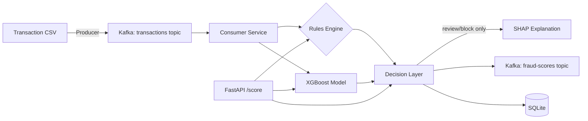

# fraud-radar-ml


A real-time transaction fraud scoring system inspired by **Stripe Radar** — combining a rules engine, XGBoost, SHAP explainability, and a Kafka streaming pipeline behind a deployed FastAPI service. Not just a model in a notebook: a scored, explainable, rules-aware decision layer, containerized and running live on AWS.

See [`ARCHITECTURE.md`](./ARCHITECTURE.md) for full system design, every major decision made across all four build phases, and real benchmark numbers.

## Why this project

Most fraud-detection portfolios stop at "trained a classifier on a Kaggle dataset." This project reflects how fraud scoring actually works in production:

- **Decision bands** (`allow` / `review` / `block`), not a binary label — validated against real test data, not just picked by intuition
- **Rules engine alongside the ML model** — each rule grounded in an actual EDA finding, not arbitrary thresholds
- **Explainability per flagged decision** — SHAP values surface *why* a transaction was flagged, scoped to avoid unnecessary latency on obviously-legitimate transactions
- **Real-time streaming** — transactions replayed through Kafka and scored as they arrive, not batch-only
- **Deployed and internet-reachable** — a live FastAPI endpoint on EC2, not just a local demo

## Architecture



## Live Demo

The API is deployed on EC2, built and pushed to ECR automatically via GitHub Actions on every push to `main`.

```bash
curl http://<ec2-public-ip>:8000/health
curl -X POST http://<ec2-public-ip>:8000/score -H "Content-Type: application/json" -d '{ ... }'
```

**Honest note:** the instance is stopped between demo sessions to control AWS cost, and no Elastic IP is configured — the public IP changes each time the instance restarts. If you'd like a live demo, reach out and I'll spin it up and share the current IP.

## Tech Stack

| Layer | Choice |
|---|---|
| Data | [Kaggle Credit Card Fraud Detection (ULB)](https://www.kaggle.com/mlg-ulb/creditcardfraud) |
| Modelling | XGBoost (production), Logistic Regression + Isolation Forest (evaluated, not deployed) |
| Rules Engine | Custom, EDA-grounded threshold rules |
| Explainability | SHAP (TreeExplainer), scoped to flagged decisions |
| Streaming | Kafka (Docker Compose, KRaft mode, dual listeners for host/container networking) |
| Serving | FastAPI |
| Persistence | SQLite |
| Containerization | Docker (multi-stage, `linux/amd64` targeted) |
| CI/CD | GitHub Actions → ECR |
| Deployment | AWS EC2 (IAM instance role, no hardcoded keys) |

## Project Structure

fraud-radar-ml/
├── README.md
├── ARCHITECTURE.md
├── requirements.txt
├── .gitignore
├── pytest.ini
├── docker-compose.yml
├── Dockerfile
├── .github/workflows/deploy.yml
├── data/raw/ # gitignored, see Setup below
├── notebooks/
│ ├── 01_eda.ipynb
│ └── 02_baseline_models.ipynb
├── src/
│ ├── config.py
│ ├── data_loader.py
│ ├── features.py
│ ├── train.py
│ ├── evaluate.py
│ ├── rules.py
│ ├── decision.py
│ ├── explain.py
│ ├── kafka_utils.py
│ ├── producer.py
│ ├── consumer.py
│ ├── persistence.py
│ ├── api.py
│ ├── benchmark.py
│ └── benchmark_kafka.py
├── models/xgboost.joblib # committed deliberately — see Progress Log, Day 5
└── tests/

## Setup

```bash
git clone https://github.com/RahimAbbas55/Fraud-Radar-ML.git
cd fraud-radar-ml
python -m venv venv
source venv/bin/activate
pip install -r requirements.txt
```

Download the dataset from [Kaggle: Credit Card Fraud Detection (ULB)](https://www.kaggle.com/mlg-ulb/creditcardfraud) and place it at `data/raw/creditcard.csv`:

```bash
kaggle datasets download -d mlg-ulb/creditcardfraud -p data/raw/ --unzip
```

Expected shape: 284,807 rows × 31 columns (`Time`, `V1`–`V28`, `Amount`, `Class`).

## Kafka Setup

```bash
docker compose up -d
docker compose ps  # confirm status shows (healthy)
```

Create the required topics (one-time step — topics don't persist across `docker compose down` + recreation, only `docker compose stop`):

```bash
docker exec fraud-radar-kafka kafka-topics --create \
  --topic transactions --bootstrap-server localhost:9092 \
  --partitions 1 --replication-factor 1

docker exec fraud-radar-kafka kafka-topics --create \
  --topic fraud-scores --bootstrap-server localhost:9092 \
  --partitions 1 --replication-factor 1

docker exec fraud-radar-kafka kafka-topics --list --bootstrap-server localhost:9092
```

Run the full pipeline (Kafka + producer + consumer) in one command:
```bash
docker compose up --build
```

## AWS Deployment

```bash
# Build for EC2's architecture (matters if building on Apple Silicon)
docker buildx build --platform linux/amd64 -t fraud-radar-api:latest . --load

# Authenticate and push to ECR
aws ecr get-login-password --region us-east-1 | docker login --username AWS --password-stdin <account-id>.dkr.ecr.us-east-1.amazonaws.com
docker tag fraud-radar-api:latest <account-id>.dkr.ecr.us-east-1.amazonaws.com/fraud-radar-api:latest
docker push <account-id>.dkr.ecr.us-east-1.amazonaws.com/fraud-radar-api:latest
```

GitHub Actions (`.github/workflows/deploy.yml`) automates this build/push on every push to `main` that touches `src/`, `requirements.txt`, `Dockerfile`, or `models/`.

On the EC2 instance (IAM instance role handles ECR auth, no keys needed):
```bash
aws ecr get-login-password --region us-east-1 | docker login --username AWS --password-stdin <account-id>.dkr.ecr.us-east-1.amazonaws.com
docker pull <account-id>.dkr.ecr.us-east-1.amazonaws.com/fraud-radar-api:latest
docker run -d --name fraud-radar-api -p 8000:8000 <account-id>.dkr.ecr.us-east-1.amazonaws.com/fraud-radar-api:latest
```

## Roadmap

- [x] **Phase 1 — Data & Modelling**: EDA, supervised vs. unsupervised model comparison (precision/recall/PR-AUC)
- [x] **Phase 2 — Kafka Streaming**: Docker Compose broker, producer, consumer, SQLite persistence, containerization
- [x] **Phase 3 — Decision Layer + API**: rules engine, decision bands, SHAP explainability, FastAPI endpoint
- [x] **Phase 4 — Monitoring, Docs, Deployment**: benchmarking, architecture docs, live AWS deployment

## Progress Log

### Day 1 — Data loading, validation, and EDA foundations
- Added `src/data_loader.py`: validated data loading with explicit schema checks (missing columns, nulls, unexpected target values) so malformed data fails loudly at load time, not silently downstream
- Fixed a data path bug: `RAW_DATA_PATH` originally pointed to `data/creditcard.csv`, but the dataset was organized at `data/raw/creditcard.csv`. Also fixed a `.gitignore` bug in the process — `data/*.csv` only ignores files directly inside `data/`, not nested folders; changed to `data/**/*.csv`
- Added `src/features.py`: stratified train/test split utility (fraud is ~0.17% of the data, so stratification is required — a random split risks a test set with almost no fraud examples) and an `hour_of_day` feature derived from `Time`, motivated directly by the EDA finding that fraud disproportionately clusters in specific (likely overnight) time windows
- Added `pytest.ini` to fix `src` module discovery from the project root
- Wrote 8 unit tests across `data_loader` and `features` using small synthetic dataframes, so the suite stays fast and doesn't depend on the Kaggle CSV being present
- EDA notebook (`01_eda.ipynb`):
  - Class distribution: confirmed ~0.173% fraud rate (492 / 284,807) — this is why accuracy is the wrong metric for this project, and why PR-AUC/precision/recall will be used for model comparison instead
  - `Amount` by class: fraud has a *higher mean* (£122 vs £88) but *lower median* (£9.25 vs £22.00) than legitimate transactions — suggesting a mix of small-value fraud (possibly card-testing) rather than fraud simply skewing toward large purchases
  - `Time` by class: fraud disproportionately spikes during low-traffic windows, consistent with overnight hours — a real-world pattern (fraud is less likely to be noticed while the cardholder is asleep) that directly motivated the `hour_of_day` feature above
  - Correlation of `V1`-`V28` with `Class`: `V17`, `V14`, `V12`, `V10` showed the strongest linear signal; this is a baseline to compare against XGBoost's feature importances in Phase 1's modelling step — agreement would be reassuring, disagreement wouldn't necessarily mean a bug, since correlation only captures linear relationships

### Day 2 — Baseline model training and comparison
- Scaffolded `02_baseline_models.ipynb`, reusing Day 1's validated loader, `hour_of_day` feature, and stratified split — confirmed train/test split held the 0.173% fraud ratio almost exactly (394/98 fraud cases)
- Added `src/evaluate.py`: shared evaluation utilities (precision, recall, F1, PR-AUC, plain-language confusion matrix breakdown) used identically across all three models, guaranteeing a fair comparison
- **Logistic Regression baseline:** hit a convergence warning from `lbfgs`, traced to unscaled features (`Amount`/`Time` vs PCA components on wildly different scales) — fixed with a `Pipeline` + `StandardScaler` to avoid data leakage. Result: 90.8% recall but only 5.6% precision (1,501 false positives to catch 89/98 fraud cases) — a direct, expected consequence of `class_weight='balanced'`
- **XGBoost:** 83.7% recall, 86.3% precision (13 false positives, 82/98 fraud caught) — a substantially more usable precision/recall balance than Logistic Regression, at a small recall cost. PR-AUC 0.881, the strongest of the three models
- **Isolation Forest** (trained only on non-fraud transactions, no fraud labels seen during training): weakest baseline result — 24.5% recall, 18.9% precision, PR-AUC 0.103
- **Contamination tuning investigation:** swept `contamination` from 0.0017 to 0.05. PR-AUC stayed identical (0.1035) at every value — confirming this parameter only shifts the precision/recall cutoff point, not the model's underlying ability to separate fraud from normal transactions. At `contamination=0.05`, recall reached 84.7% (competitive with XGBoost) but produced 2,934 false positives (vs XGBoost's 13) — not a usable tradeoff. Concluded the weak result isn't a tuning artifact; genuinely improving it would require feature selection or deeper hyperparameter changes, flagged as future work
- Promoted training logic into `src/train.py`, a parameterized CLI script (`python -m src.train --model xgboost|isolation_forest`)
- Added `load_model()` utility for reproducible model loading
- Wrote 6 additional unit tests (`evaluate.py`, `train.py`) using synthetic data and mock models

**Honest takeaway:** XGBoost is the clear leader on offline metrics and the most realistic production candidate. Isolation Forest's architectural value (catching novel fraud patterns without labels) remains a valid reason to keep it in the system design, but this baseline doesn't demonstrate that value — dominated by XGBoost on every metric tested, tuning included.

### Day 3 — Kafka streaming setup (complete)
- Added `docker-compose.yml`: single-broker Kafka in KRaft mode (no Zookeeper) — a deliberate scope choice for a portfolio-scale demo over a multi-broker cluster
- Created `transactions` and `fraud-scores` topics (1 partition, replication factor 1 each)
- Added `src/kafka_utils.py`: shared broker config and JSON serialization/deserialization
- Added `src/producer.py`: replays `creditcard.csv` row-by-row to the `transactions` topic with a configurable delay, simulating near-real-time arrival
- Added `src/consumer.py`: long-running service that scores each incoming transaction with the trained XGBoost model in real time
- **Bug found and fixed during end-to-end testing:** producer wasn't applying the `hour_of_day` feature before sending messages, causing every scored transaction to fail — unit tests hadn't caught this since they used hand-built messages that already included the feature
- **Second bug found via testing, not production:** a hand-written test with columns in a different order than training exposed that `score_transaction` had no explicit safeguard against feature order. Fixed by explicitly reindexing to `model.get_booster().feature_names` before scoring
- **End-to-end verification (local):** 5,000 transactions replayed and scored live. Result: 1 fraud case flagged (`txn_id=4920`, 99.99% confidence), correctly matching the true label. Zero false positives across the batch
- Added `src/persistence.py`: SQLite persistence layer for scored results
- **Containerized the full pipeline**, requiring a real Kafka networking fix: two listeners (`HOST` for host-machine connections, `INTERNAL` for container-to-container), since `localhost` means something different from inside a container than from the host
- **End-to-end verification (containerized):** ran the full pipeline via `docker compose up --build` — Kafka healthy, producer/consumer waited correctly via `depends_on: condition: service_healthy`, 500 transactions sent and scored successfully using the internal listener

**Honest scope note:** Kafka has no persistent volume configured, so topics and messages don't survive a full container removal.

### Day 4 — Radar-style decision layer, SHAP explainability, FastAPI endpoint
- Added `src/rules.py`: rules engine with two rules grounded directly in Day 1 EDA findings — `high_amount` (a guardrail, not a strong standalone signal per EDA) and `unusual_hour_borderline_score` (fires only when an overnight hour combines with an already-borderline ML score, avoiding a naive "flag everything at night" false-positive problem)
- Added `src/decision.py`: combines the ML probability and fired rules into an `allow`/`review`/`block` decision band. Key design choice: a fired rule can only escalate a decision toward more caution, never downgrade it — verified explicitly via tests
- Wired the decision layer into `consumer.py`, replacing the old binary 0.5-threshold logic; updated the SQLite schema (`decision`, `fired_rules` columns replacing the old `prediction` column)
- Added `src/explain.py`: SHAP (TreeExplainer) explainability, computed only for `review`/`block` decisions
- Added `src/api.py`: FastAPI `/score` endpoint reusing `score_transaction` from the consumer so the Kafka pipeline and the API produce identical decisions by construction
- **Bug found via testing, not production:** a `TestClient` opened in isolation inside one test triggered the app's `lifespan` shutdown on exit, silently clearing shared model state and breaking a different, still-open test. Fixed by removing the unnecessary isolation
- **Threshold validation:** ran the real Day 2 test set (56,962 transactions, 98 real fraud) through the full decision layer. Combined `block`+`review` recall of 84.7% (83/98), 89.0% precision within `block` — both improvements over the raw threshold baseline. Honest finding: the `review` band is under-earning its keep, at 1.3% precision (2 real fraud out of 154 flagged) — flagged `ALLOW_THRESHOLD` as a concrete tuning target, not treated as solved

### Day 5 — Benchmarking, architecture docs, AWS deployment
- Added `src/benchmark.py`: API latency/throughput benchmark. Result: **257 req/sec, p50 3.38ms, p95 5.88ms, p99 7.16ms** (500 requests, ~10% mixed to trigger review/block + SHAP)
- Added `src/benchmark_kafka.py`: Kafka consumer throughput benchmark. Result: **154.1 messages/sec sustained** (1,000 messages, includes SQLite write + re-publish per message)
- Added `ARCHITECTURE.md`: full system documentation — component breakdown, every major design decision from all 4 phases with the reasoning behind it, real benchmark numbers, and an honest limitations section
- Fixed Docker build for `linux/amd64` (Apple Silicon builds default to arm64, EC2 needs amd64) via `docker buildx` and `$TARGETPLATFORM`
- Set up GitHub Actions to build and push to ECR automatically on push to `main`
- **Two real, connected bugs found during deployment:**
  - A trailing comment from an earlier commit landed on the same line as the Dockerfile's `CMD` instruction, silently breaking the array syntax — the container pulled fine but failed to start
  - `requirements.txt` had been overwritten at some point with a full local-environment dependency dump (pinned versions specific to my Mac) instead of the actual project dependencies — caused a `pip install` failure that Docker's build cache was silently hiding, since the CMD fix never touched `requirements.txt` and so never invalidated the broken cached layer. Only surfaced by forcing a `--no-cache` rebuild. This also explains why GitHub Actions appeared to silently not trigger earlier — it was very likely failing the same way, not skipping
  - Fixed both: cleaned Dockerfile, restored a minimal `requirements.txt` with no pinned versions
- Deployed to a dedicated EC2 instance: IAM instance role for ECR pull (no AWS keys on the server), SSH restricted to a single IP, API port open publicly
- Verified `/health` and `/score` live over the real internet — confirmed a `review` decision with a correctly fired rule and a real SHAP explanation returned from the deployed container

**Honest note:** the EC2 instance is stopped between demo sessions to control cost, and no Elastic IP is configured — the public IP changes on restart, so any previously shared link may not stay reachable.

**Project status: complete.** All four phases — data/modelling, streaming, decision layer + explainability, and deployment — built, tested, and verified end to end, including live over the internet.

---

*Part of a data science portfolio targeting data science & fintech roles. See also: [UK-Tech-Job-Analyzer](https://github.com/RahimAbbas55/UK-Tech-Job-Analyzer) and [Credit Risk ML Pipeline][https://github.com/RahimAbbas55/Credit-Risk-ML-Pipeline].*