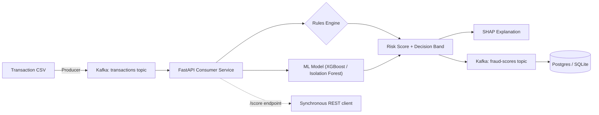

# fraud-radar-ml


A real-time transaction fraud scoring system inspired by **Stripe Radar** — combining a rules engine, machine learning (XGBoost + Isolation Forest), and explainability (SHAP) behind a streaming pipeline, to mirror how production fintech fraud systems are actually architected: not just a model in a notebook, but a scored, explainable, rules-aware decision layer.

## Why this project

Most fraud-detection portfolios stop at "trained a classifier on a Kaggle dataset." This project is built to reflect how fraud scoring actually works in production:

- **Continuous risk score + decision band** (`allow` / `review` / `block`), not a binary label
- **Rules engine alongside the ML model** — mirroring Radar's approach of combining merchant-defined rules with a learned risk score
- **Explainability per decision** — SHAP values surface *why* a transaction was flagged
- **Real-time streaming**, not batch scoring — transactions replayed through Kafka and scored as they arrive
- **Supervised vs. unsupervised comparison** — an honest discussion of why a bank might choose a lower-offline-metric unsupervised model in production (label latency, concept drift)

## Architecture



## Tech Stack

| Layer | Choice |
|---|---|
| Data | [Kaggle Credit Card Fraud Detection (ULB)](https://www.kaggle.com/mlg-ulb/creditcardfraud) |
| Modelling | Scikit-learn (Isolation Forest), XGBoost, SHAP |
| Rules Engine | Custom threshold-based rules (amount, velocity) |
| Streaming | Kafka (Docker Compose, KRaft mode) |
| Serving | FastAPI |
| Containerization | Docker Compose |
| Deployment | AWS |

## Project Structure

```
fraud-radar-ml/
├── README.md
├── requirements.txt
├── .gitignore
├── docker-compose.yml          # added Phase 2
├── data/                       # raw data (gitignored, see setup below)
├── notebooks/
│   └── 01_eda.ipynb
├── src/
│   ├── config.py
│   ├── data_loader.py
│   ├── features.py
│   ├── train.py
│   └── evaluate.py
├── models/                     # trained models (gitignored)
└── tests/
    └── test_features.py
```
## Setup

```bash
git clone https://github.com/RahimAbbas55/Fraud-Radar-ML.git
cd fraud-radar-ml
python -m venv venv
source venv/bin/activate
pip install -r requirements.txt
```

Download the dataset from [Kaggle: Credit Card Fraud Detection (ULB)](https://www.kaggle.com/mlg-ulb/creditcardfraud) and place it at `data/raw/creditcard.csv`. Options:

```bash
# via Kaggle CLI (requires kaggle.json API token in ~/.kaggle/)
kaggle datasets download -d mlg-ulb/creditcardfraud -p data/raw/ --unzip

# or manually: download the zip from the Kaggle page above,
# unzip, and move creditcard.csv into data/raw/
```

Expected shape after download: 284,807 rows × 31 columns (`Time`, `V1`–`V28`, `Amount`, `Class`).

## Roadmap

- [x] Phase 1, Day 1 — data loading, validation, EDA foundations
- [x] **Phase 1 — Data & Modelling**: EDA, supervised vs. unsupervised model comparison (precision/recall/PR-AUC)
- [ ] **Phase 2 — Kafka Streaming Setup**: Docker Compose Kafka broker, producer replay script, consumer service
- [ ] **Phase 3 — Radar-Style Decision Layer + API**: rules engine, risk score + decision bands, SHAP explainability, FastAPI endpoint
- [ ] **Phase 4 — Monitoring, Docs, Deployment**: latency/throughput benchmarking, architecture docs, AWS deployment

## Progress Log

### Day 1 — Data loading, validation, and EDA foundations
- Added `src/data_loader.py`: validated data loading with explicit schema checks (missing columns, nulls, unexpected target values) so malformed data fails loudly at load time, not silently downstream
- Fixed a data path bug: `RAW_DATA_PATH` originally pointed to `data/creditcard.csv`, but the dataset was organized at `data/raw/creditcard.csv`. Also fixed a `.gitignore` bug in the process — `data/*.csv` only ignores files directly inside `data/`, not nested folders; changed to `data/**/*.csv`
- Added `src/features.py`: stratified train/test split utility (fraud is ~0.17% of the data, so stratification is required — a random split risks a test set with almost no fraud examples) and an `hour_of_day` feature derived from `Time`, motivated directly by the EDA finding that fraud disproportionately clusters in specific (likely overnight) time windows
- Added `pytest.ini` to fix `src` module discovery from the project root
- Wrote 8 unit tests across `data_loader` and `features` using small synthetic dataframes, so the suite stays fast and doesn't depend on the Kaggle CSV being present
- EDA notebook (`01_eda.ipynb`):
  - Class distribution: confirmed ~0.173% fraud rate (492 / 284,807) — this is why accuracy is the wrong metric for this project, and why PR-AUC/precision/recall will be used for model comparison instead
  - `Amount` by class: fraud has a *higher mean* (£122 vs £88) but *lower median* (£9.25 vs £22.00) than legitimate transactions — suggesting a mix of small-value fraud (possibly card-testing) rather than fraud simply skewing toward large purchases
  - `Time` by class: fraud disproportionately spikes during low-traffic windows, consistent with overnight hours — a real-world pattern (fraud is less likely to be noticed while the cardholder is asleep) that directly motivated the `hour_of_day` feature above
  - Correlation of `V1`-`V28` with `Class`: `V17`, `V14`, `V12`, `V10` showed the strongest linear signal; this is a baseline to compare against XGBoost's feature importances in Phase 1's modelling step — agreement would be reassuring, disagreement wouldn't necessarily mean a bug, since correlation only captures linear relationships

### Day 2 — Baseline model training and comparison
- Scaffolded `02_baseline_models.ipynb`, reusing Day 1's validated loader, `hour_of_day` feature, and stratified split — confirmed train/test split held the 0.173% fraud ratio almost exactly (394/98 fraud cases)
- Added `src/evaluate.py`: shared evaluation utilities (precision, recall, F1, PR-AUC, plain-language confusion matrix breakdown) used identically across all three models, guaranteeing a fair comparison
- **Logistic Regression baseline:** hit a convergence warning from `lbfgs`, traced to unscaled features (`Amount`/`Time` vs PCA components on wildly different scales) — fixed with a `Pipeline` + `StandardScaler` to avoid data leakage. Result: 90.8% recall but only 5.6% precision (1,501 false positives to catch 89/98 fraud cases) — a direct, expected consequence of `class_weight='balanced'`
- **XGBoost:** 83.7% recall, 86.3% precision (13 false positives, 82/98 fraud caught) — a substantially more usable precision/recall balance than Logistic Regression, at a small recall cost. PR-AUC 0.881, the strongest of the three models
- **Isolation Forest** (trained only on non-fraud transactions, no fraud labels seen during training): weakest baseline result — 24.5% recall, 18.9% precision, PR-AUC 0.103
- **Contamination tuning investigation:** swept `contamination` from 0.0017 to 0.05. PR-AUC stayed identical (0.1035) at every value — confirming this parameter only shifts the precision/recall cutoff point, not the model's underlying ability to separate fraud from normal transactions. At `contamination=0.05`, recall reached 84.7% (competitive with XGBoost) but produced 2,934 false positives (vs XGBoost's 13) — not a usable tradeoff. Concluded the weak result isn't a tuning artifact; genuinely improving it would require feature selection or deeper hyperparameter changes, flagged as future work
- Promoted training logic into `src/train.py`, a parameterized CLI script (`python -m src.train --model xgboost|isolation_forest`) — chosen over training all three models or hardcoding one, since the project's architecture (see diagram above) calls for both XGBoost and Isolation Forest as parallel signals, and Logistic Regression had already been ruled out as a production candidate given its false-positive rate
- Added `load_model()` utility for reproducible model loading — verified it correctly restores a fully-configured, usable `XGBClassifier` from disk
- Wrote 6 additional unit tests (`evaluate.py`, `train.py`) using synthetic data and mock models, following the same fast/isolated pattern established on Day 1

**Honest takeaway:** XGBoost is the clear leader on offline metrics and the most realistic production candidate right now. Isolation Forest's architectural value (catching novel fraud patterns without labels) remains a valid reason to keep it in the system design, but this baseline doesn't yet demonstrate that value — it was dominated by XGBoost on every metric tested, tuning included.

**Next up (Day 3):** Kafka streaming setup — Docker Compose broker, producer replay script, consumer service.

---

*Part of a data science portfolio targeting data science & fintech roles. See also: [UK-Tech-Job-Analyzer](#) and [Credit Risk ML Pipeline](#).*