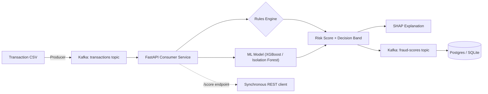

# fraud-radar-ml


A real-time transaction fraud scoring system inspired by **Stripe Radar** — combining a rules engine, machine learning (XGBoost + Isolation Forest), and explainability (SHAP) behind a streaming pipeline, to mirror how production fintech fraud systems are actually architected: not just a model in a notebook, but a scored, explainable, rules-aware decision layer.

## Why this project

Most fraud-detection portfolios stop at "trained a classifier on a Kaggle dataset." This project is built to reflect how fraud scoring actually works in production:

- **Continuous risk score + decision band** (`allow` / `review` / `block`), not a binary label
- **Rules engine alongside the ML model** — mirroring Radar's approach of combining merchant-defined rules with a learned risk score
- **Explainability per decision** — SHAP values surface *why* a transaction was flagged
- **Real-time streaming**, not batch scoring — transactions replayed through Kafka and scored as they arrive
- **Supervised vs. unsupervised comparison** — an honest discussion of why a bank might choose a lower-offline-metric unsupervised model in production (label latency, concept drift)

## Architecture



## Tech Stack

| Layer | Choice |
|---|---|
| Data | [Kaggle Credit Card Fraud Detection (ULB)](https://www.kaggle.com/mlg-ulb/creditcardfraud) |
| Modelling | Scikit-learn (Isolation Forest), XGBoost, SHAP |
| Rules Engine | Custom threshold-based rules (amount, velocity) |
| Streaming | Kafka (Docker Compose, KRaft mode) |
| Serving | FastAPI |
| Containerization | Docker Compose |
| Deployment | AWS |

## Project Structure

```
fraud-radar-ml/
├── README.md
├── requirements.txt
├── .gitignore
├── docker-compose.yml          # added Phase 2
├── data/                       # raw data (gitignored, see setup below)
├── notebooks/
│   └── 01_eda.ipynb
├── src/
│   ├── config.py
│   ├── data_loader.py
│   ├── features.py
│   ├── train.py
│   └── evaluate.py
├── models/                     # trained models (gitignored)
└── tests/
    └── test_features.py
```

## Setup

```bash
git clone https://github.com/<your-username>/fraud-radar-ml.git
cd fraud-radar-ml
python -m venv venv
source venv/bin/activate
pip install -r requirements.txt
```

Download the dataset from [Kaggle](https://www.kaggle.com/mlg-ulb/creditcardfraud) and place `creditcard.csv` in `data/`.

## Roadmap

- [ ] **Phase 1 — Data & Modelling**: EDA, supervised vs. unsupervised model comparison (precision/recall/PR-AUC)
- [ ] **Phase 2 — Kafka Streaming Setup**: Docker Compose Kafka broker, producer replay script, consumer service
- [ ] **Phase 3 — Radar-Style Decision Layer + API**: rules engine, risk score + decision bands, SHAP explainability, FastAPI endpoint
- [ ] **Phase 4 — Monitoring, Docs, Deployment**: latency/throughput benchmarking, architecture docs, AWS deployment

## Progress Log

### Day 1
- Project scaffolded, repo structure initialized

---

*Part of a data science portfolio targeting UK fintech roles. See also: [UK-Tech-Job-Analyzer](#) and [Credit Risk ML Pipeline](#).*